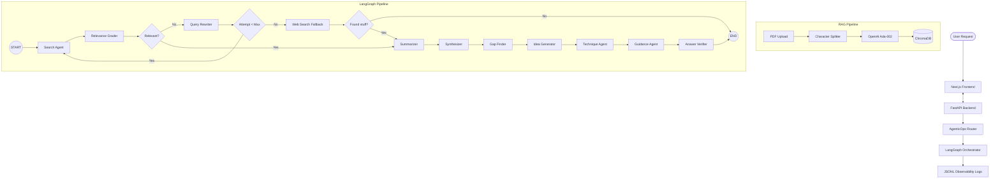
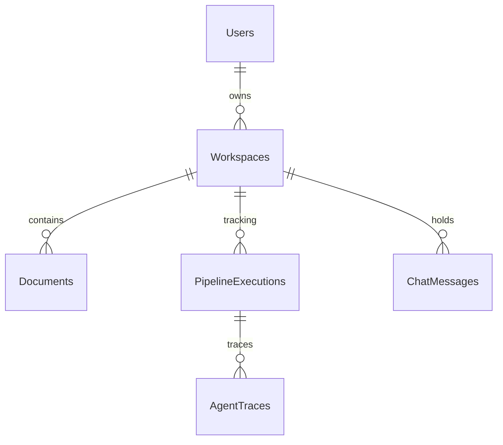

# ReAssist Architecture

## System Overview
ReAssist has shifted from an imperative monolithic router into a **LangGraph-backed declarative state machine**. The pipeline orchestrates 11 specialized AI Agents: 7 core intelligence agents + 4 QA/verification agents.

## Database Schema

